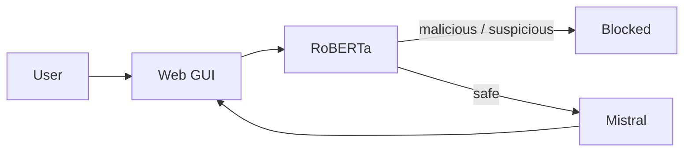

# SCADA LLM Security Middleware

## Table of Contents

1. [Overview](#1-overview)
2. [Flow](#2-flow)
3. [Installation](#3-installation)
4. [Docs](#4-docs)

---

## 1. Overview

Middleware de seguridad académico para requests y respuestas de modelos de lenguaje en contextos SCADA. Intercepta, clasifica, valida y audita cada interacción entre clientes y LLMs.



---

## 2. Flow

1. User sends a message from the web GUI
2. RoBERTa classifies the prompt — trained to detect malicious code intent in SCADA context
3. If **malicious** or **suspicious** → blocked, never reaches Mistral
4. If **safe** → Mistral generates a response
5. Response is validated and sent back to the user

---

## 3. Installation

```powershell
git clone https://github.com/jeffersonmejia/middelware-roberta-mistral.git
cd backend-llm
pip install -r requirements.txt
cp .env.example .env
.\scripts\run.ps1
```

---

## 4. Docs

| File | Content |
|---|---|
| [API.md](docs/API.md) | Endpoints, request/response, error codes |
| [ARCHITECTURE.md](docs/ARCHITECTURE.md) | Middleware components and data flow |
| [MODEL.md](docs/MODEL.md) | Classifier usage and limitations |
| [REQUIREMENTS.md](docs/REQUIREMENTS.md) | Integration contracts, microservices, env vars |
| [SECURITY.md](SECURITY.md) | Vulnerability reporting and secrets |
